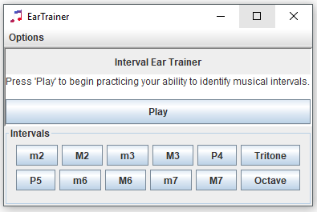
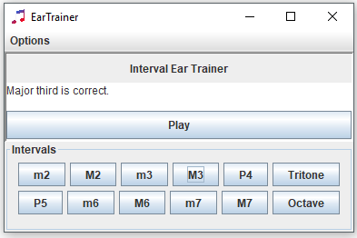
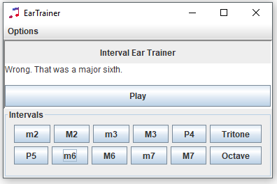
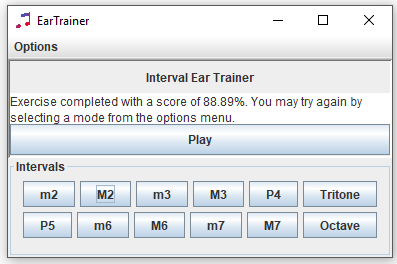
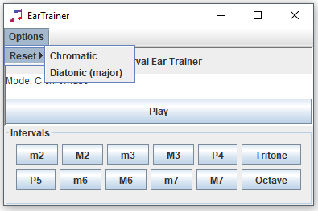

# Ear Trainer

# About

Ear Trainer is a simple java application to test a musician's interval identification skills. In music, an interval refers to the difference in pitch between two notes. For example, the following table lists the relation in pitch between the root note C:

| Root | Destination | Interval Name | Interval Symbol |
| --- | --- | --- | --- |
| C | C | Unison | P1 |
| C | C# or Db | Minor 2nd | m2 |
| C | D | Major 2nd | M2 |
| C | D# or Eb | Minor 3rd | m3 |
| C | E | Major 3rd | M3 |
| C | F | Perfect 4th | P4 |
| C | F# or Gb | Tritone | TT |
| C | G | Perfect 5th | P5 |
| C | G# or Ab | Minor 6th | m6 |
| C | A | Major 6th | M6 |
| C | A# or Bb | Minor 7th | m7 |
| C | B | Major 7th | M7 |
| C | C | Octave | P8 |

This program uses C as the root note for which all intervals will be named. The default setting (diatonic) will only exercise the intervals of the major scale: unison/octave, and all perfect/P and major/M intervals. The chromatic setting includes all 12 possible intervals from the root note.

Retrospectively, I've learned a lot about concise appropriate documentation/design in OOP. In addition, this assignment served as a demonstration of concepts learned in CS 112, specifically the use of lists, exception handling, and model-view-control (MVC) model programming. Future iterations of this project would include the use of root notes other than C, as well as inverted intervals (where the notes are sounded in ascending order).

## Usage

Startup

Correct selection

Incorrect selection

Exercise completed

Menu selection

