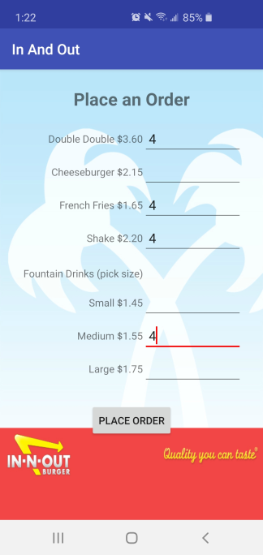

# In And Out

An exercise on using multiple Activities and Intents. This application places a user's orders at the fictional "In And Out Burger".

## OrderActivity

This Activity utilizes a Tablelayout to group the TextViews and EditTexts corresponding to each menu item. The prices listed utilize string resouces with placeholders to reflect the values defined in the model (Order).

When the user clicks on the "Place Order" button, an Intent will be created that sends the information from each EditText to SummaryActivity.

## SummaryActivity

This Activity creates an Order with the information sent from OrderActivity. The number of items ordered, subtotal, tax, and order total are then calculated and presented in their corresponding Views.
