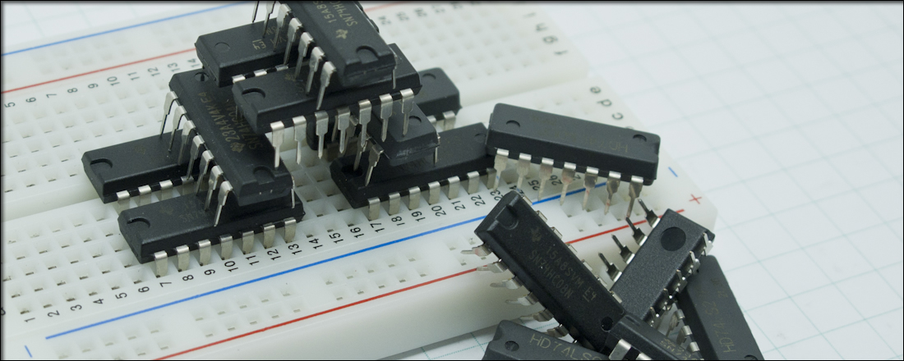

# Loops and Computer Logic

## Java Project Name: IC10_TruthTables



As you continue your journey in Computer Science, you will have time to become familiar with **boolean algebra** as it relates to computer architecture and assembly language. Specifically, computer hardware operates on the processing of binary/boolean values, which are represented as 1 (`true`) and 0 (`false`). **Truth tables** are constructed to list each possible value for a given boolean function's operands and its resulting output. To start, here are some basic boolean operations and expressions, "not", "and", and "or":

**Logical negation (NOT p, ~p, ¬p)**: negates an operand's binary value, switching it from 1/`true` to 0/`false` or 0/`false` to 1/`true`.

**Logical conjunction (p AND q, p & q, pq)**: returns 1/`true` only when *both* operands' binary values are 1/`true`.

**Logical disjunction (p OR q, p || q, p + q)**: returns 1/`true` when *at least one* of the two operands' binary values are 1/`true`.

----------

## Context

### The Ternary Operator (?:)

In this project, you will evaluate boolean functions based on values of 0 (representing `false`) and 1 (representing `true`) for operands `p`, `q`, `r`, and `s`. For example, consider the following function, where the two operands `p` and `q` are integer variables:

`p AND q`

If both operands are `true`, or `p == 1` and `q == 1`, then the result of this function would be 1 (or `true`). Otherwise, it would evaluate to 0 (or `false`). Using an integer variable to store the result, this logic could be implemented in code:

```
int result;

if (p == 1 && q == 1) 
{
	result = 1; // true assignment
else 
{
	result = 0; // false assignment
}
```

In cases where a variable is assigned a value based on a single condition statement, use of the **ternary operator** (`?:`) could consolidate these if-else blocks into one line of code. A statement which uses this operator has the following syntax: 

```
(condition) ? trueExpression : falseExpression;
```

`condition` refers to any statement that would evaluate to a boolean value. If said statement returns `true`, then the code between the `?` and `:` is executed; otherwise, the code following the `:` is executed. Compare this with a single if-else operation:

```
if (condition)
{
	trueExpression;
{
else
{
	falseExpression;
}
```

In place of the if-else statement, the value of `result` for the boolean function `p AND q` could therefore be stored using the following assignment. If both `p` and `q` are equal to 1, then assign the value 1 (representing `true`) to `result`; otherwise, assign 0 (representing `false`) to this variable. 

```
result = (p == 1 && q == 1) ? 1 : 0;
```

### Nested Loops

A **nested loop** is a loop whose block contains another loop. To implement the creation of a truth table for `p AND q` in code, nested for-loops will be used to produce all permutations of values in `p` and `q` for use in this boolean function.

```
int result; // To be set to 1 (representing true) or 0 (representing false).

System.out.println("| P | Q | P and Q |");
System.out.println("|---|---|---------|");

for (int p = 0; p <= 1; p++) 
{
	// Inside Outer Loop

	for (int q = 0; q <= 1; q++) 
	{
		// Inside Inner Loop

		// 1. Evaluate expression using ternary operator.
		result = (p == 1 && q == 1) ? 1 : 0;
		
		// 2. Print formatted row for p, q, and result using printf.
		System.out.printf("| %d | %d |    %d    |%n", p, q, result);

	} // End of inner loop, q from 0 to 1.

} // End of outer loop, p from 0 to 1.
```

The resulting output is a formatted truth table evaluating the boolean function `p AND q`. This visual allows the user to observe all permutations of input values for `p` and `q` and the resulting output for each. 

```
| P | Q | P and Q |
|---|---|---------|
| 0 | 0 |    0    |
| 0 | 1 |    0    |
| 1 | 0 |    0    |
| 1 | 1 |    1    |
```

These permutations are displayed in the order in which each iteration of the nested loops execute their code, with booth loops iterating from 0 (`false`) to 1 (`true`). The outer loop completes its current iteration *after* the inner loop completes *all* its iterations. This sequence can be visualized with the following table:

```
| Outer Loop | Inner Loop |
|------------|------------|
| p = 0      | q = 0      | (0, 0)
|            | q = 1      | (0, 1)
| p = 1      | q = 0      | (1, 0)
|            | q = 1      | (1, 1)
```

The above examples demonstrate nested loops with only two operands, `p` and `q`. Similarly, the operands `r` and `s` may also be added to this nested sequence, with the evaluation occuring within the innermost loop `s`:

```
// Outermost loop level 0
for (int p = 0; p <= 1; p ++) 
{
	// Inner loop level 1
	for (int q = 0; q <= 1; q++) 
	{
		// Inner loop level 2
		for (int r = 0; r <= 1; r++)
		{	
			// Innermost loop level 3
			for (int s = 0; s <= 1; s++)
			{
				// evaluate given expression here
			}
		}
	}
}
```
----------

## Project Structure

Using nested for-loops, this program will construct five formatted truth tables for the following boolean expressions:

1. p AND NOT q
2. NOT (p OR q)
3. p AND q OR r
4. (NOT p OR NOT q) AND (NOT r)
5. (p AND q) OR (r AND s)

Below is possible output based on the above specifications:

```
| P | Q | P and not Q |
|---|---|-------------|
| 0 | 0 |      0      |
| 0 | 1 |      0      |
| 1 | 0 |      1      |
| 1 | 1 |      0      |

| P | Q | not(P or Q) |
|---|---|-------------|
| 0 | 0 |      1      |
| 0 | 1 |      0      |
| 1 | 0 |      0      |
| 1 | 1 |      0      |

| P | Q | R | P and Q or R |
|---|---|---|--------------|
| 0 | 0 | 0 |       0      |
| 0 | 0 | 1 |       1      |
| 0 | 1 | 0 |       0      |
| 0 | 1 | 1 |       1      |
| 1 | 0 | 0 |       0      |
| 1 | 0 | 1 |       1      |
| 1 | 1 | 0 |       1      |
| 1 | 1 | 1 |       1      |

| P | Q | R | (not P or not Q) and not R |
|---|---|---|----------------------------|
| 0 | 0 | 0 |              1             |
| 0 | 0 | 1 |              0             |
| 0 | 1 | 0 |              1             |
| 0 | 1 | 1 |              0             |
| 1 | 0 | 0 |              1             |
| 1 | 0 | 1 |              0             |
| 1 | 1 | 0 |              0             |
| 1 | 1 | 1 |              0             |

| P | Q | R | S | (P and Q) or (R and S) |
|---|---|---|---|------------------------|
| 0 | 0 | 0 | 0 |            0           |
| 0 | 0 | 0 | 1 |            0           |
| 0 | 0 | 1 | 0 |            0           |
| 0 | 0 | 1 | 1 |            1           |
| 0 | 1 | 0 | 0 |            0           |
| 0 | 1 | 0 | 1 |            0           |
| 0 | 1 | 1 | 0 |            0           |
| 0 | 1 | 1 | 1 |            1           |
| 1 | 0 | 0 | 0 |            0           |
| 1 | 0 | 0 | 1 |            0           |
| 1 | 0 | 1 | 0 |            0           |
| 1 | 0 | 1 | 1 |            1           |
| 1 | 1 | 0 | 0 |            1           |
| 1 | 1 | 0 | 1 |            1           |
| 1 | 1 | 1 | 0 |            1           |
| 1 | 1 | 1 | 1 |            1           |
```