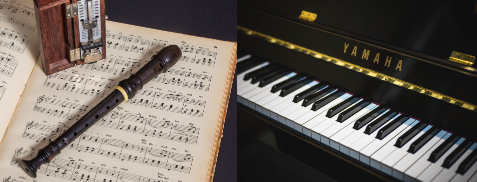

# Abstraction and Inheritance

## Java Project Name: IC28_AbstractInstrumentInheritance



> Merriam-Webster defines a musical instrument as "a device used to produce music". As musicians and music fans, we know that there are many different ways to produce music with any device intended for that purpose; would you blow through it like a flute, pluck it like a harp, or strike it like a drum? In this assignment, you will make such devices tangible through the creation of an abstract `Instrument` class with two concrete descendants, `Piano` and `Recorder`.

## Context

* A musical **scale** is an organized sequence of notes. For example, here is the C major scale: C, D, E, F, G, A, B, (C) ... Repeating this cycle of 7 notes.
* A **chord** is a group of 3+ notes sounded together. For example, chord 1 in C major (starting with C) is C-E-G, chord 2 in C major (starting with D) is D-F-A, and chord 7 in C major (starting with B) is B-D-F. Notice how in all of these cases, the notes are two note names apart from each other.
* We can imagine a scale as an array of notes in a specific sequence/ordering. For the C major scale, only the white keys of the piano are played:


## Project Structure

### Instrument: An abstract class to represent a musical instrument, containing abstract methods which are to be defined in its (concrete) descendant classes.
1. Using the `abstract` modifier in its class heading, this class will be abstract and therefore unable to be instantiated. 
2. This class contains an instance variable for its current ***note*** (int), and a `final` `static` collection of Strings to represent the 7 notes in the C major ***SCALE*** ("C", "D", "E", "F", "G", "A", "B").
3. Uses non-abstract accessor and mutator methods for the Instrument's `mNote` value, where said value is an integer within the range 0-6 in relation to the above array representing the C major `SCALE`.
4. An abstract method called `play()` will be provided for an Instrument to present a single note or a chord (3 notes) based on its `mNote` value as it relates to an index within the C major `SCALE`. Because this is an abstract method, there will be no method body as it will be implemented in the following descendants. 

### Piano: Another concrete subclass of Instrument with additional helper methods and values.
1. Contains instance variables for the ***number of keys*** (int) and a boolean array of size 7, named `mChord`, which is parallel to Instrument's array representing the C major `SCALE`. Java initializes each index of this array to false.
2. Uses a constructor with 2 parameters (numKeys, note), and a default constructor which creates an 88-key Piano playing note 0 ("C").
3. The two constructors, in addition to the overridden `setNote(int note)` method, calls upon a private helper method named `setChord()`. 
    - This method will set all indices of `mChord` to false, except for the index that is equal to the Piano's current `note`, the value of `mNote` + 2, and `mNote` + 4. 
    - Because these index values could exceed the bounds of `mChord`, you must utilize the `%` operator to "wrap around" the array if necessary. This will be useful for illustration in the Piano's `play()` method.
4. Overrides Object's `toString()` method to represent the Piano in the following format:
    > "[Piano: 88 keys, playing a chord with root note C]"
5. Overrides Instrument's `play()` method to display a graphic (seen below) which demonstrates one way to play a chord with the given root `mNote` within the C major `SCALE`. 
    - With exception to the last one, each line of the ASCII art will always be assigned to a String local to this method.
    - In a loop examining each element of `mChord`, each key will be concatenated to the above String. If `mChord[i]` is `true`, `SCALE[i]` will be concatenated; "_" otherwise.
    - Lastly, this String will be printed to the console in addition to the Piano's overridden `toString()`.

### Recorder: A concrete subclass of Instrument.
1. Contains a constructor with a single parameter (note), and a default constructor which creates a Recorder playing note 0 ("C").
2. Overrides Object's `toString()` method to represent the Recorder in the following format:
    > "[Recorder: playing note E]"
3. Overrides Instrument's `play()` method to display a graphic (seen below) which demonstrates the Recorder's fingering to play its current `mNote` in relation to the C major `SCALE`. For example, "C" requires all 8 finger-holes to be covered, "D" requiring only the last 7, and so on. 
    - The String variable local to this method will be initialized to the top and beginning portion of the given ASCII art recorder.
    - Loops may be used to print a total of 7 holes in relation to Instrument's array for the C major `SCALE`. The number of open spaces ("[ ]") is equal to the current `mNote` value, whereas the remaining spaces are covered ("[X]").
    - Because each note requires the rightmost space to be covered, the ending portion of the ASCII art includes an additonal "[X]".
    - This method will also call upon the Recorder's overridden `toString()` method to print its information to the console.

### InstrumentDemo: In this driver program, you will create a rather unorthodox octet comprised of only Pianos and Recorders to observe the polymorphic nature of each Instrument's invocation of the play method. 
1. Create an array of Instruments, instantating 4 Pianos and 4 Recorders.
2. Loop through this array, calling the play method for each Instrument. Observe the behaviors of each Instrument as they invoke this method at run-time.

----------

Below is a UML diagram demonstrating the class inheritance:


And here is the output based on the above algorithm:

```
[Piano: 88 keys, playing a chord with root note C]
|  | | | |  |  | | | | | |  |
|  | | | |  |  | | | | | |  |
|  | | | |  |  | | | | | |  |
|  |_| |_|  |  |_| |_| |_|  |
|   |   |   |   |   |   |   |
|   |   |   |   |   |   |   |
|_C_|___|_E_|___|_G_|___|___|

[Piano: 88 keys, playing a chord with root note E]
|  | | | |  |  | | | | | |  |
|  | | | |  |  | | | | | |  |
|  | | | |  |  | | | | | |  |
|  |_| |_|  |  |_| |_| |_|  |
|   |   |   |   |   |   |   |
|   |   |   |   |   |   |   |
|___|___|_E_|___|_G_|___|_B_|

[Piano: 61 keys, playing a chord with root note G]
|  | | | |  |  | | | | | |  |
|  | | | |  |  | | | | | |  |
|  | | | |  |  | | | | | |  |
|  |_| |_|  |  |_| |_| |_|  |
|   |   |   |   |   |   |   |
|   |   |   |   |   |   |   |
|___|_D_|___|___|_G_|___|_B_|

[Piano: 76 keys, playing a chord with root note B]
|  | | | |  |  | | | | | |  |
|  | | | |  |  | | | | | |  |
|  | | | |  |  | | | | | |  |
|  |_| |_|  |  |_| |_| |_|  |
|   |   |   |   |   |   |   |
|   |   |   |   |   |   |   |
|___|_D_|___|_F_|___|___|_B_|

[Recorder: playing note B]
         ____,,______________________________,,_
(^_^)// ()____[ ]_[ ]_[ ]_[ ]_[ ]_[ ]_[X]__[X]__)

[Recorder: playing note G]
         ____,,______________________________,,_
(^_^)// ()____[ ]_[ ]_[ ]_[ ]_[X]_[X]_[X]__[X]__)

[Recorder: playing note E]
         ____,,______________________________,,_
(^_^)// ()____[ ]_[ ]_[X]_[X]_[X]_[X]_[X]__[X]__)

[Recorder: playing note C]
         ____,,______________________________,,_
(^_^)// ()____[X]_[X]_[X]_[X]_[X]_[X]_[X]__[X]__)

```
